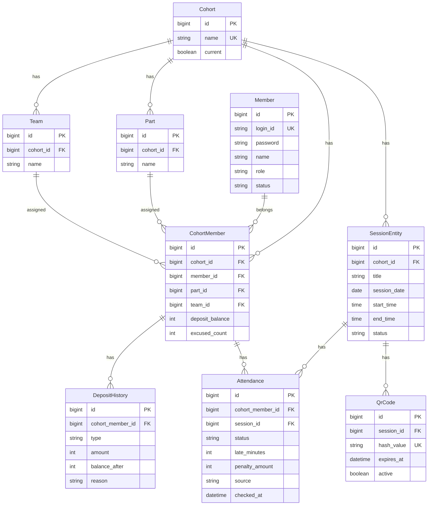

# ERD

```mermaid
erDiagram
    Cohort ||--o{ Part : has
    Cohort ||--o{ Team : has
    Cohort ||--o{ CohortMember : has
    Member ||--o{ CohortMember : belongs
    Part ||--o{ CohortMember : assigned
    Team ||--o{ CohortMember : assigned
    Cohort ||--o{ SessionEntity : has
    SessionEntity ||--o{ QrCode : has
    SessionEntity ||--o{ Attendance : has
    CohortMember ||--o{ Attendance : has
    CohortMember ||--o{ DepositHistory : has

    Cohort {
        bigint id PK
        string name UK
        boolean current
    }

    Part {
        bigint id PK
        bigint cohort_id FK
        string name
    }

    Team {
        bigint id PK
        bigint cohort_id FK
        string name
    }

    Member {
        bigint id PK
        string login_id UK
        string password
        string name
        string role
        string status
    }

    CohortMember {
        bigint id PK
        bigint cohort_id FK
        bigint member_id FK
        bigint part_id FK
        bigint team_id FK
        int deposit_balance
        int excused_count
    }

    SessionEntity {
        bigint id PK
        bigint cohort_id FK
        string title
        date session_date
        time start_time
        time end_time
        string status
    }

    QrCode {
        bigint id PK
        bigint session_id FK
        string hash_value UK
        datetime expires_at
        boolean active
    }

    Attendance {
        bigint id PK
        bigint cohort_member_id FK
        bigint session_id FK
        string status
        int late_minutes
        int penalty_amount
        string source
        datetime checked_at
    }

    DepositHistory {
        bigint id PK
        bigint cohort_member_id FK
        string type
        int amount
        int balance_after
        string reason
    }
```
