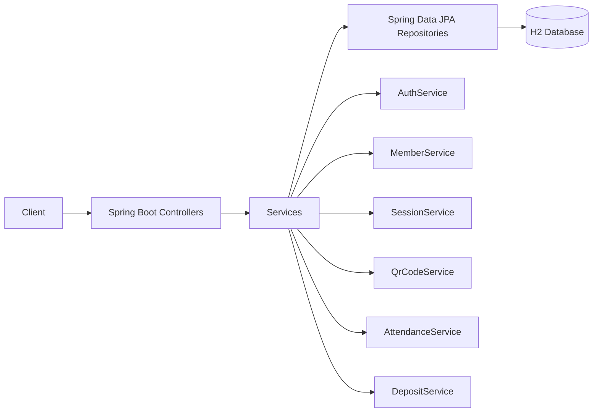

# System Design Architecture

## 구성

- Client: REST API 호출
- Controller Layer: 요청/응답, validation
- Service Layer: 비즈니스 규칙(출결/패널티/보증금/공결 제한)
- Repository Layer: JPA 기반 데이터 접근
- Database: H2 (in-memory)

## 구조도

## 핵심 설계 포인트

- 공통 응답 포맷(`success/data/error`)으로 API 일관성 유지
- 에러코드 enum + 전역 예외 처리로 명세 기반 오류 응답 통일
- 출결/보증금 로직을 서비스 레이어에 집중해 테스트 용이성 확보
- 시드 데이터 자동 초기화로 실행 즉시 API 검증 가능
