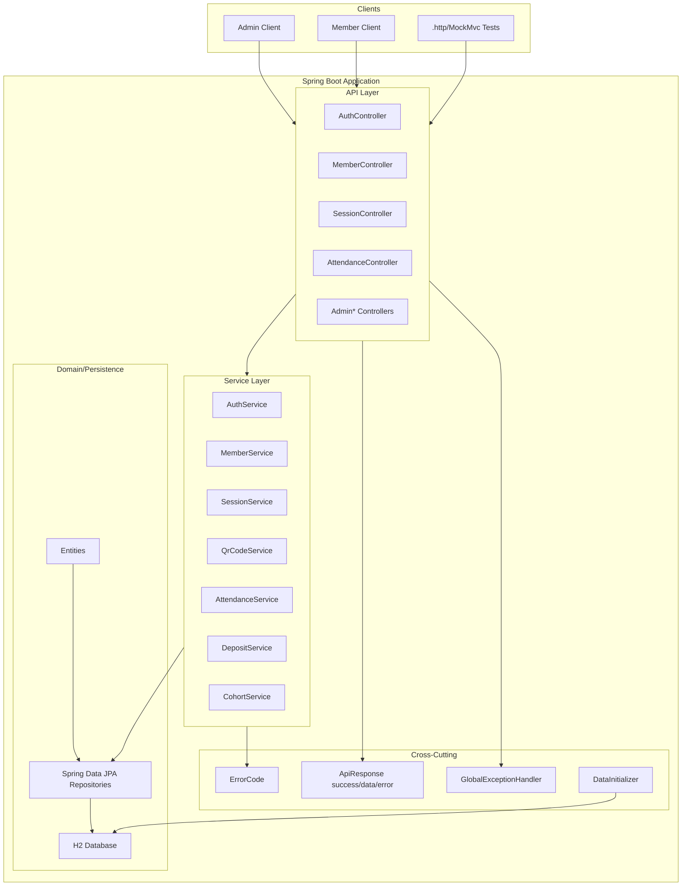
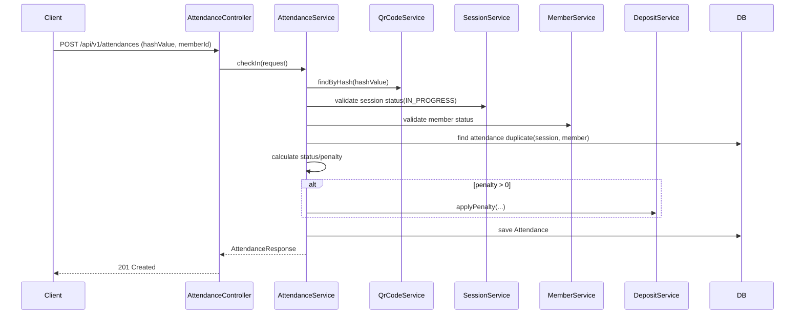

# System Design Architecture

## 1) 전체 구조

## 2) 핵심 도메인 흐름 (출석 체크)

## 3) 설계 원칙

- API 계약은 명세 기반으로 유지하고, 모든 응답을 `ApiResponse(success/data/error)`로 통일합니다.
- 컨트롤러는 입출력/검증에 집중하고, 비즈니스 규칙은 서비스 계층에 모아 테스트 가능성을 높입니다.
- 출결/패널티/보증금 변경은 트랜잭션으로 처리해 정합성을 보장합니다.
- 에러는 `ErrorCode`와 전역 예외 처리로 HTTP 상태코드와 메시지를 일관되게 반환합니다.
